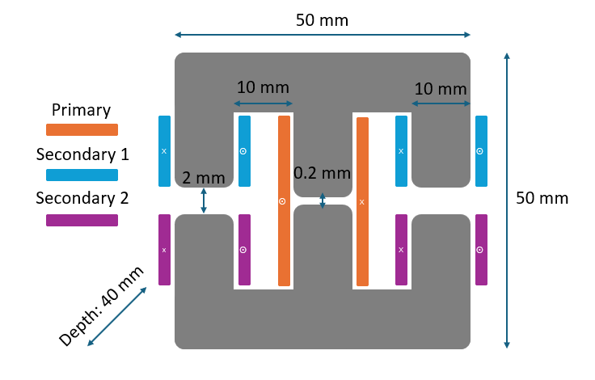

# AsymTrans

6.S892 Advanced Topics in Power Electronics Course Project
Integrated multi-winding transformers for decoupled MAB power flow: a case study of three-winding transformers in TAB

## Repository Structure

| File / Folder     | Description                                |
| ----------------- | ------------------------------------------ |
| `asymtrans.FEM`   | Main FEM file, can be directly opened in FEMM software.                            |
| `fem_results/`    | FEM results folder for three measurements. |
| `ecm_para.m`           | MATLAB script to compute the parameters in the extended cantilever model.          |
| `tab.slx`         | Simulink validation of Triple-Active-Bridge Converter.                             |

## Related Link

[FEMM](https://www.femm.info/wiki/HomePage)

[Extended Cantilever Model](https://ieeexplore.ieee.org/document/9003574)

[Decoupled MAB](https://ieeexplore.ieee.org/document/9130931)